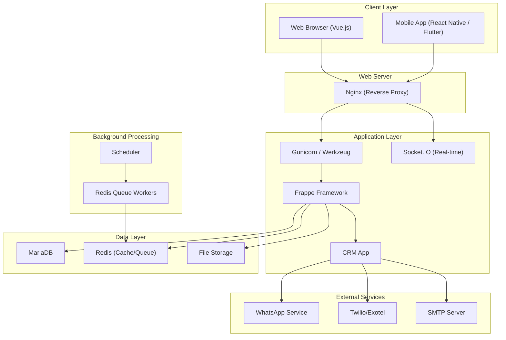
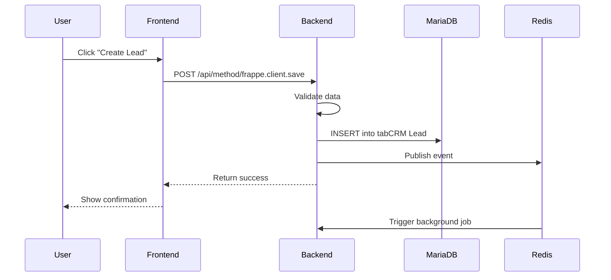
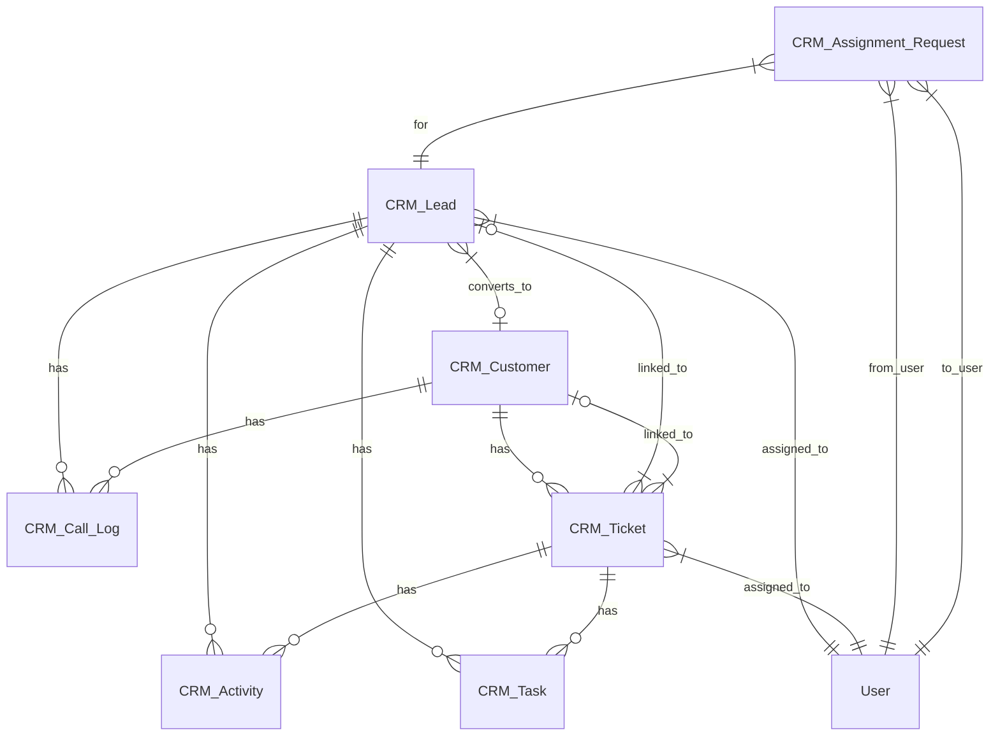
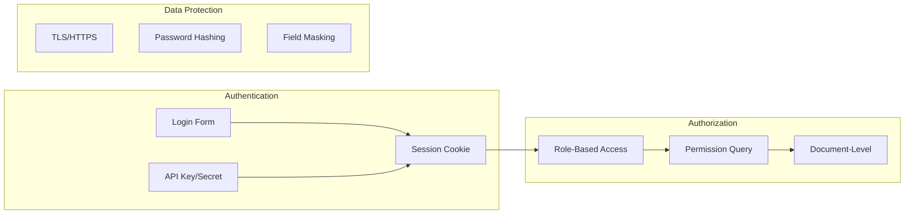
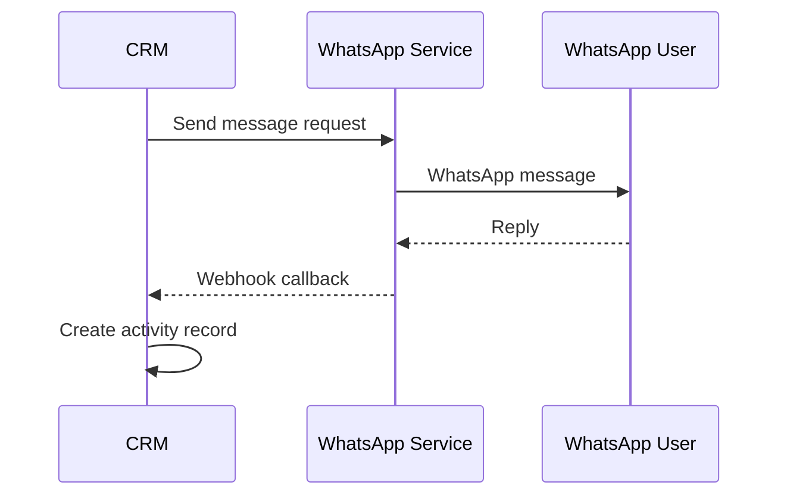
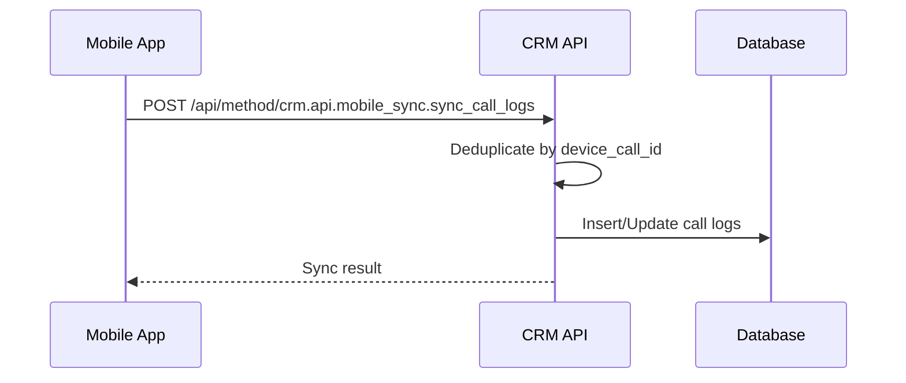

# System Architecture

Technical architecture of Eshin Broking CRM System.

---

## High-Level Architecture



---

## Technology Stack

| Layer | Technology | Version | Purpose |
|-------|------------|---------|---------|
| **Frontend** | Vue.js | 3.x | UI framework |
| **Frontend** | Frappe UI | Latest | Component library |
| **Frontend** | Vite | 5.x | Build tool |
| **Backend** | Python | 3.10+ | Server language |
| **Backend** | Frappe | v15 | Application framework |
| **Database** | MariaDB | 10.8+ | Primary database |
| **Cache** | Redis | 6+ | Caching & queues |
| **Web Server** | Nginx | 1.18+ | Reverse proxy |
| **Process** | Supervisor | 4+ | Process manager |
| **Mobile** | React Native | - | Android app |
| **Mobile** | Flutter | - | Alternative Android app |

---

## Component Details

### Frontend Architecture

```
Vue.js Application
├── Router (Vue Router)
│   └── Pages (Dashboard, Leads, Tickets, etc.)
├── State Management (Pinia/Vuex)
│   └── Stores (User, Leads, Settings)
├── Components (Frappe UI + Custom)
│   └── Modals, Forms, Lists, Activities
└── API Layer (Frappe call/resource)
    └── HTTP requests to backend
```

### Backend Architecture

```
Frappe Framework
├── Router (werkzeug)
│   └── /api/method/* endpoints
├── DocTypes (Data Models)
│   └── CRM Lead, CRM Ticket, CRM Customer, etc.
├── Controllers (Python Classes)
│   └── Business logic per DocType
├── Hooks (hooks.py)
│   └── Event handlers, schedulers
└── Patches (Database Migrations)
    └── Schema changes, data migrations
```

### Data Flow



---

## DocType Relationships



---

## Background Processing

### Job Queues

| Queue | Purpose | Workers |
|-------|---------|---------|
| **short** | Quick jobs, notifications | 2 |
| **default** | Standard processing | 2 |
| **long** | Heavy tasks, exports | 1 |

### Scheduled Tasks

| Schedule | Task | Purpose |
|----------|------|---------|
| Every minute | Task reassignment | Process overdue tasks |
| Every minute | Task notifications | Send due reminders |
| Daily 02:00 | Backup script | Automated backup |
| Daily 17:25 | Bench backup | Secondary backup |

---

## Security Architecture



---

## Deployment Architecture

### Single Server (Development/Small Team)

```
Ubuntu Server
├── Nginx (port 80/443)
├── Frappe Bench
│   ├── Gunicorn (port 8000)
│   ├── SocketIO (port 9000)
│   ├── Workers (background)
│   └── Scheduler (cron)
├── MariaDB
├── Redis
└── Supervisor (process management)
```

### Production (Recommended)

```
Load Balancer
├── App Server 1
│   ├── Nginx
│   ├── Gunicorn
│   └── Workers
├── App Server 2 (replica)
│   └── ...
├── Database Server
│   ├── MariaDB (primary)
│   └── MariaDB (replica)
├── Cache Server
│   └── Redis Cluster
└── File Storage
    └── S3 / NFS
```

---

## Integration Points

### WhatsApp Service



### Mobile App Sync



---

## Performance Considerations

| Area | Strategy |
|------|----------|
| Database | Indexes on frequently queried fields |
| Caching | Redis for session, cache, queue |
| Frontend | Lazy loading, code splitting |
| API | Pagination, field selection |
| Background | Async processing for heavy tasks |

---

## Monitoring Points

| Metric | Tool | Threshold |
|--------|------|-----------|
| Response time | Nginx logs | < 200ms |
| Error rate | frappe.log | < 1% |
| Queue depth | Redis | < 1000 |
| Database connections | MariaDB | < 100 |
| Memory usage | htop | < 80% |
