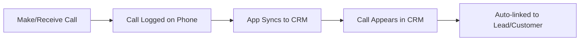

# Call Logs

Call Logs track all phone communications with leads and customers. Calls can be logged manually or synced automatically from mobile devices.

---

## Purpose

The Call Logs module helps you:
- View all call history in one place
- Track call outcomes and durations
- Link calls to leads/customers
- Sync calls from mobile devices

**Typical Users:** All users with CRM access

---

## Call Log Sources

| Source | Description |
|--------|-------------|
| **Mobile Sync** | Automatic sync from Android devices |
| **Manual Entry** | Manually logged calls |
| **Twilio** | VoIP calls through Twilio integration |
| **Exotel** | Calls through Exotel integration |

---

## Viewing Call Logs

### Call Logs List

1. Click **Call Logs** in sidebar (or access from Dashboard)
2. View list showing:
   - Call direction (Incoming/Outgoing)
   - Phone number
   - Duration
   - Date/time
   - Linked Lead/Customer
   - Status

<!-- UI File: frontend/src/pages/CallLogs.vue -->

### Filter Options

| Filter | Options |
|--------|---------|
| Date Range | Today, This Week, Custom |
| Call Type | Incoming, Outgoing, Missed |
| User | Filter by call owner |
| Status | Completed, Missed, Rejected |

---

## Call Statuses

| Status | Icon | Description |
|--------|------|-------------|
| Completed | 🟢 | Call connected and ended normally |
| Missed | 🔴 | Incoming call not answered |
| Rejected | 🔴 | Call explicitly rejected |
| No Answer | 🟡 | Outgoing call not answered |
| Busy | 🟡 | Line was busy |
| Cold Call | 🔵 | First outbound contact attempt |

---

## Call Log Details

Click any call to view details:

| Field | Description |
|-------|-------------|
| **From** | Calling number |
| **To** | Receiving number |
| **Type** | Incoming/Outgoing |
| **Status** | Call outcome |
| **Duration** | Call length (HH:MM:SS) |
| **Start Time** | When call started |
| **End Time** | When call ended |
| **Linked To** | Associated Lead/Customer |
| **Owner** | User who made/received call |

<!-- TODO: Capture call log detail showing all fields and linked record -->

---

## Mobile Call Sync

### Overview

The Eshin CRM mobile app automatically syncs call logs from your Android device.

### Setup Requirements

1. Install Eshin CRM mobile app on Android
2. Grant call log permissions
3. Login with your CRM credentials
4. Enable auto-sync

### Sync Process

### Manual Sync

1. Open mobile app
2. Go to Dashboard
3. Tap **Sync Now**
4. Calls sync to CRM

<!-- TODO: Capture mobile app sync status indicator -->

---

## Linking Calls to Records

### Automatic Linking

Calls are automatically linked when:
- Phone number matches a Lead's mobile
- Phone number matches a Customer's mobile
- Phone number matches alternative mobile

### Manual Linking

If a call is not linked:

1. Open call log entry
2. Click **Link to Lead/Customer**
3. Search and select record
4. Save

<!-- TODO: Capture linking a call log to a lead/customer -->

---

## Cold Call Tagging

Calls marked as "Cold Call" indicate first outbound contact:

### How It Works

- First outgoing call to a number = Cold Call
- Subsequent calls = Regular calls
- Helps track prospecting activity

### Dashboard Analytics

Cold calls appear in dashboard metrics:
- Today's cold calls count
- Cold call conversion rate
- Team cold call activity

---

## Date Filtering

### Quick Filters

| Filter | Date Range |
|--------|------------|
| Today | Current day |
| Yesterday | Previous day |
| This Week | Mon-Sun of current week |
| Last Week | Previous Mon-Sun |
| This Month | Current calendar month |
| Custom | Select start and end dates |

### Custom Date Range

1. Click date filter dropdown
2. Select **Custom**
3. Choose start date
4. Choose end date
5. Click **Apply**

---

## Monthly Summary Export

Export call logs for reporting:

### Steps

1. Go to Call Logs page
2. Apply desired date filters
3. Click **Export** button
4. Select format (CSV/Excel)
5. Download file

### Export Fields

- Date/Time
- Direction
- Number
- Duration
- Status
- Owner
- Linked Lead/Customer

---

## SOP: Reviewing Daily Calls

### Purpose
Daily review of call activity.

### Steps

1. **Open Call Logs**
   - Click Call Logs in sidebar

2. **Filter to Today**
   - Select "Today" date filter

3. **Review Each Call**
   - Check if linked to correct lead/customer
   - Note any unlinked calls

4. **Link Unlinked Calls**
   - Open each unlinked call
   - Search for matching record
   - Create lead if new prospect

5. **Update Activities**
   - Add notes to relevant leads
   - Create follow-up tasks

### Verification
- [ ] All calls reviewed
- [ ] Calls linked to records
- [ ] Follow-ups scheduled

---

## Troubleshooting

| Issue | Solution |
|-------|----------|
| Calls not syncing | Check mobile app permissions |
| Call shows wrong user | Check call ownership in app |
| Duplicate calls | System auto-detects, may need merge |
| Missing call details | Check phone's call log retention |

---

## Power User Tips

- **Quick Link** - Click phone number to call
- **Filter by Owner** - See only your calls
- **Keyboard Nav** - Use arrows to navigate list
- **Dashboard Widget** - Pin call stats to dashboard

---

## Related Guides

- [Leads](leads.md) - Calls linked to leads
- [Customers](customers.md) - Calls linked to customers
- [Dashboard](dashboard.md) - Call analytics
