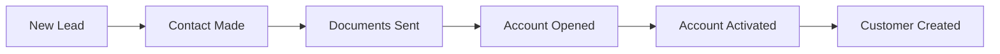
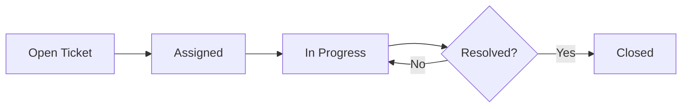

# User Guide Overview

Welcome to the Eshin Broking CRM User Guide. This documentation helps you get the most out of your CRM system for daily sales and customer support operations.

---

## Purpose

Eshin Broking CRM is designed for financial services teams to:

- **Track Leads** - Manage prospects from first contact to conversion
- **Handle Support Tickets** - Resolve customer issues efficiently
- **Log Communications** - Record calls, WhatsApp messages, and activities
- **Manage Tasks** - Stay on top of follow-ups and deadlines
- **Analyze Performance** - View metrics and KPIs on dashboards

---

## User Roles

| Role | Access Level | Primary Functions |
|------|--------------|-------------------|
| **Sales User** | Standard | Manage assigned leads, log activities, create tasks |
| **Support User** | Standard | Handle support tickets, communicate with customers |
| **Manager** | Elevated | View team performance, approve assignments, access reports |
| **Admin** | Full | System configuration, user management, all data access |

---

## Main Interface

<!-- TODO: Capture full CRM interface view showing sidebar, main content area, and top bar -->

---

## Navigation

### Sidebar Menu

The left sidebar provides access to all modules:

| Icon | Module | Description |
|------|--------|-------------|
| 📊 | **Dashboard** | Analytics and quick metrics |
| 👤 | **Leads** | Lead management |
| 🎫 | **Tickets** | Support ticket queue |
| 🏢 | **Customers** | Customer database |
| 📞 | **Call Logs** | Call history and sync |
| ✅ | **Tasks** | Task management |
| 📋 | **Requests** | Assignment request approvals |
| ⚙️ | **Settings** | Personal and system settings |

<!-- UI File: frontend/src/components/Layouts/AppSidebar.vue -->

---

### Top Navigation Bar

<!-- TODO: Capture top bar showing search, notifications, and user menu -->

---

## UI Conventions

### Status Colors

| Color | Meaning |
|-------|---------|
| 🟢 Green | Active, Open, Success |
| 🟡 Yellow | Pending, In Progress |
| 🔴 Red | Urgent, Overdue, Failed |
| ⚪ Gray | Closed, Archived |
| 🔵 Blue | New, Assigned |

### Action Buttons

- **+ Create** - Add new record (top right of list views)
- **Edit** - Modify record (pencil icon)
- **Delete** - Remove record (trash icon, requires confirmation)
- **Assign** - Transfer ownership (person icon)

### Quick Filters

Most list views include quick filters:

1. Click filter dropdown
2. Select filter criteria
3. Results update automatically
4. Click **Clear** to reset

---

## Common Workflows

### Lead-to-Customer Journey

### Support Ticket Flow

---

## Getting Help

- **In-app Help** - Click the `?` icon for contextual tips
- **Search** - Use universal search (Ctrl+K) to find anything
- **Manager** - Contact your manager for permission issues
- **Admin** - Report system issues to your administrator

---

## Next Steps

| Guide | Learn To |
|-------|----------|
| [Leads](leads.md) | Create and manage leads |
| [Tickets](tickets.md) | Handle support tickets |
| [Tasks](tasks.md) | Create and track tasks |
| [Dashboard](dashboard.md) | Analyze your performance |
